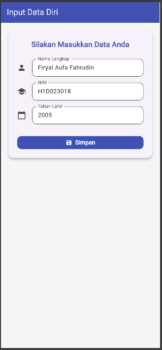

# Proyek Tugas 6 - Form Biodata Flutter

Proyek ini adalah aplikasi Flutter sederhana untuk mendemonstrasikan alur navigasi dasar dan proses pengiriman data (*passing data*) antara dua halaman menggunakan `Navigator`.

## 📸 Tampilan Aplikasi

Berikut adalah tampilan dari kedua halaman utama aplikasi:

  
  


---

## ⚙️ Penjelasan Proses Passing Data

Proses pengiriman data dari form (`form_data.dart`) ke halaman tampilan (`tampil_data.dart`) dilakukan melalui **Constructor** pada saat navigasi halaman.

Berikut adalah rincian langkah-demi-langkahnya:

### 1. Pengambilan Data di `form_data.dart` (Halaman Form)

* Setiap `TextField` (Nama, NIM, Tahun Lahir) dihubungkan ke sebuah `TextEditingController`.
* Ketika tombol "Simpan" ditekan, fungsi `_kirimData()` akan mengambil nilai teks saat ini dari setiap controller.

    ```dart
    // Cuplikan dari lib/ui/form_data.dart

    // 1. Controller untuk menampung teks
    final _namaController = TextEditingController();
    final _nimController = TextEditingController();
    final _tahunLahirController = TextEditingController();

    void _kirimData() {
      // 2. Data diambil dari controller
      String nama = _namaController.text;
      String nim = _nimController.text;
      String tahunLahir = _tahunLahirController.text;
      
      // ... lanjut ke navigasi
    }
    ```

### 2. Pengiriman Data via `Navigator.push`

* Setelah data diambil, kita memanggil `Navigator.push` untuk berpindah ke halaman baru.
* Di dalam `MaterialPageRoute`, kita membuat *instance* dari halaman tujuan kita, yaitu `TampilData`.
* **Inti prosesnya ada di sini:** Kita memasukkan data (`nama`, `nim`, `tahunLahir`) sebagai parameter ke dalam **constructor** `TampilData`.

    ```dart
    // Cuplikan dari lib/ui/form_data.dart

    void _kirimData() {
      // ... data diambil
      
      // 3. Pindah halaman sambil mengirim data
      Navigator.push(
        context,
        MaterialPageRoute(
          builder: (context) => TampilData(
            // 4. Data dilempar ke constructor TampilData
            nama: nama,
            nim: nim,
            tahunLahir: tahunLahir,
          ),
        ),
      );
    }
    ```

### 3. Penerimaan Data di `tampil_data.dart` (Halaman Tampilan)

* Halaman `TampilData` (sebuah `StatelessWidget`) sudah disiapkan untuk "menerima" data tersebut.
* Ia mendeklarasikan variabel `final String` untuk setiap data yang akan diterima.
* Ia memiliki **constructor** yang mewajibkan (`required`) parameter-parameter tersebut untuk diisi saat kelas ini dibuat (seperti yang kita lakukan di Langkah 2).

    ```dart
    // Cuplikan dari lib/ui/tampil_data.dart
    
    class TampilData extends StatelessWidget {
      // 5. Variabel final untuk menampung data yang diterima
      final String nama;
      final String nim;
      final String tahunLahir;
    
      // 6. Constructor yang 'menangkap' data yang dikirim
      const TampilData({
        super.key,
        required this.nama,
        required this.nim,
        required this.tahunLahir,
      });
    
      @override
      Widget build(BuildContext context) {
        // ...
      }
    }
    ```

### 4. Penggunaan Data

* Setelah data diterima melalui *constructor* dan disimpan di dalam variabel `final`, data tersebut kini siap digunakan di dalam *method* `build` untuk ditampilkan ke pengguna, misalnya di dalam `Text` widget.

    ```dart
    // Cuplikan dari lib/ui/tampil_data.dart
    
    @override
    Widget build(BuildContext context) {
      int umur = _hitungUmur(); // tahunLahir digunakan di sini
    
      return Scaffold(
        // ...
        body: Center(
          // ...
          child: Text(
            // 7. Data yang diterima, kini ditampilkan
            'Nama saya $nama, NIM $nim, dan umur saya adalah $umur tahun.',
            style: const TextStyle(
              fontSize: 18,
              color: Colors.white,
              height: 1.5,
            ),
          ),
        ),
      ),
    );
    }
    ```
